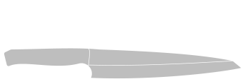
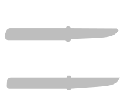

This is a collection of older and recent knife designs. Almost all of them have been built by me in various stages and provide some practical value. They are all done with solvespace.

|Design|Preview|
|---|---|
|[Whaler](knife_whaler/README.md)||
|[Andrew](knife_andrew/README.md)||
|[Eastern Promise](knife_eastern_promise/README.md)||
|[Mary](knife_mary/README.md)||
|[Km13](knife_km13/README.md)||
|[Knicker](knife_knicker/README.md)||
|[Tanto](knife_tanto/README.md)||
|[Rotwild](knife_rotwild/README.md)||
|[David](knife_david/README.md)||
|[Seax](knife_seax/README.md)||
|[Grabendolch](knife_grabendolch/README.md)||
|[Marco](knife_marco/README.md)||
|[Ringwraith](knife_ringwraith/README.md)||
|[Feather](knife_feather/README.md)||
|[Simple Hunter](knife_simple_hunter/README.md)||
|[Serpent](knife_serpent/README.md)||
|[Teo 2](knife_teo_2/README.md)||
|[Twig](knife_twig/README.md)||
|[Owl](knife_owl/README.md)||
|[Gyuto](knife_gyuto/README.md)||
|[Ostrich](knife_ostrich/README.md)||
