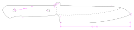

This is a collection of older and recent knife designs. Almost all of them have been built by me in various stages and provide some practical value. They are all done with solvespace.

[Owl](knife_owl/README.md)

[Simple hunter](knife_simple_hunter/README.md)

[Whaler](knife_whaler/README.md)

[Feather](knife_feather/README.md)

[Eastern promise](knife_eastern_promise/README.md)

[Grabendolch](knife_grabendolch/README.md)

[Serpent](knife_serpent/README.md)

[Tanto](knife_tanto/README.md)

[Gyuto](knife_gyuto/README.md)

[Seax](knife_seax/README.md)

[Twig](knife_twig/README.md)

[Km13](knife_km13/README.md)

