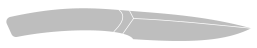
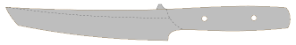

This is a collection of older and recent knife designs. Almost all of them have been built by me in various stages and provide some practical value. They are all done with solvespace.

|Design|Preview|
|---|---|
|[Owl](knife_owl/README.md)||
|[Simple hunter](knife_simple_hunter/README.md)||
|[Whaler](knife_whaler/README.md)||
|[Feather](knife_feather/README.md)||
|[Eastern promise](knife_eastern_promise/README.md)||
|[Grabendolch](knife_grabendolch/README.md)||
|[Serpent](knife_serpent/README.md)||
|[Tanto](knife_tanto/README.md)||
|[Gyuto](knife_gyuto/README.md)||
|[Seax](knife_seax/README.md)||
|[Twig](knife_twig/README.md)||
|[Km13](knife_km13/README.md)||
