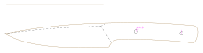

# Marco
This is the best knife I ever made. I've realized that later though. The form is nearly perfect and fits well with very thin scales. The top is angled, too, making it extremely pointed. Still, the shape is simple and elegant.
Strangely, this is one of the first knives that I did not design with CAD before I built it - the drawing is traced after a photography.

