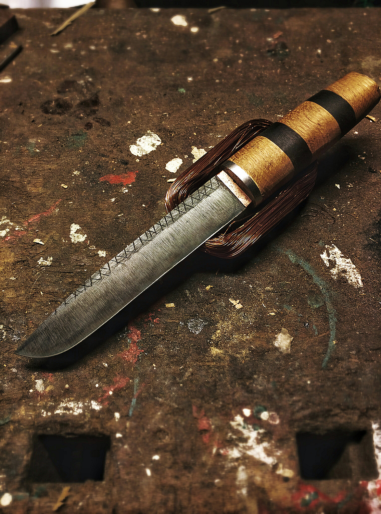

# Seax
The Seax follows traditional viking knives and modernizes them a tiny bit. The handle are just different types of wood pushed over the handle, then rounded with a belt sander. The end of the handle is threaded and holds the handle together with a nut.

